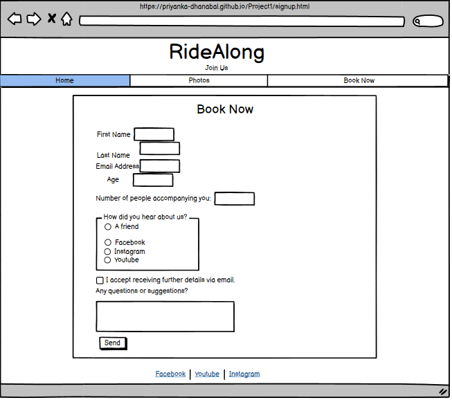
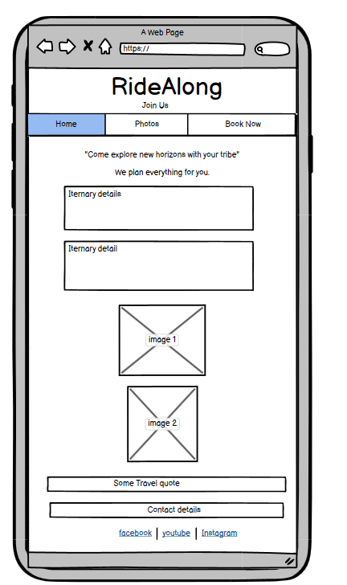
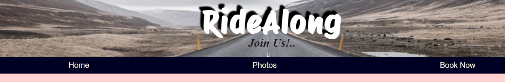
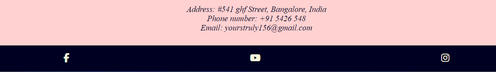
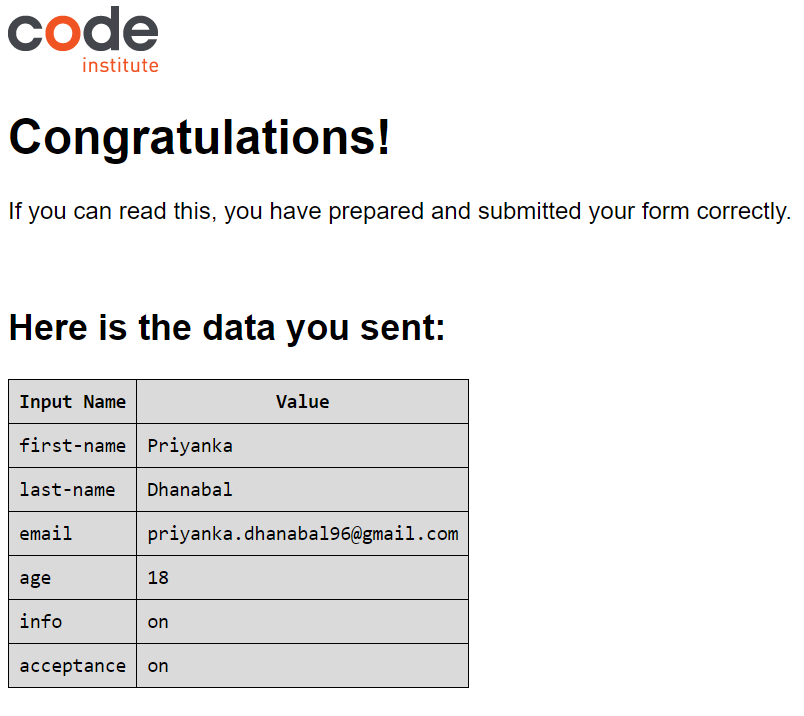
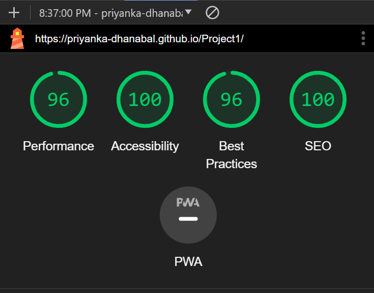
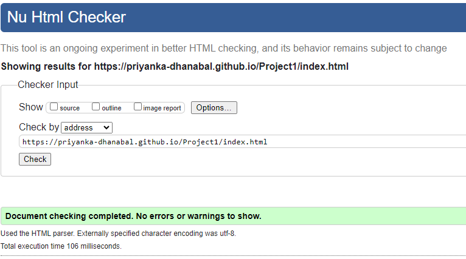
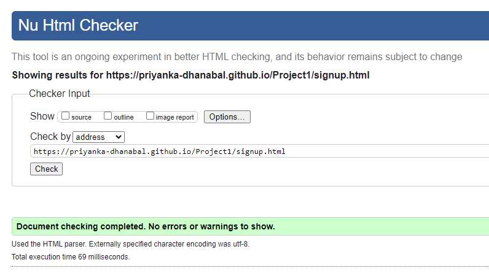
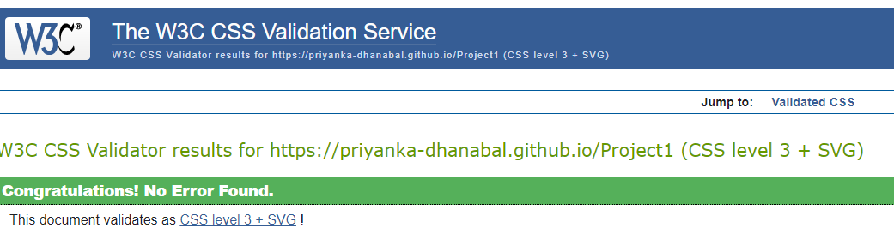

# RideAlong

## A Travel Website
> A Website showcasing an itnerary of date, venue and activities that users owning a motor bike can participate by booking. This website also alows users view photo gallery and submit a form to be part of the travel.

#### - by Priyanka Dhanabal

### [Live Website](https://priyanka-dhanabal.github.io/Project1/)
### [My Repository](https://github.com/Priyanka-Dhanabal/Project1.git)

## Table of contents

 1. [ UX ](#ux)
 2. [ Features ](#features)
 3. [ Future Feature ](#future)  
 4. [ Technology used ](#tech) 
 5. [ Testing ](#testing)  
 6. [ Bugs ](#bugs)  
 7. [ Deployment](#deployment) 
 8. [ Citation of Sources](#credits)

 ## UX

 ### Overview

 > RideAlong is a Fictional travel website I decided to come up with as I love travelling and meeting new people along the way. I always wanted to travel with my friends and few other strangers with my motor bike.

 ### Site Goal

 > The goal of this site is to provide detailed itenary of travel plan for motor bike users. This Website is mainly for those who own or can rent a motor bike and would love to meet new people. The users can rely on the administrators to arrange the stay, food and other amenties along the travel. This Website is built now for travel plans in sothern part of India. In future, additional itnenary shall be created to cover other parts of India as well.

 > The Users can see the travel plan ahead of time and plan accordingly.

 ### User Stories

 #### As a User:

 - I want to travel in india with my motor bike.
 - I want to travel to certain cities in India and checkout what is the city famous for.
 - I want to travel with my friends to places that I have never been to.
 - I want to travel without worrying about the shelter or the food.
 - I want to take part in water sport or other activities held.
 - I need not worry about safety.
 - I need not worry about the itenary.

 #### As the site administrator:

 - I want to be able to add more travel plans.
 - I want to be able to send email to inidividual users about their expenses.
 - I want to be able to arrange the shelter and food for the users joining.
 - I want to be able to take care user's safety.
 - I want to be able to arrange fun activities in the city.
 - I want to be able to assign volunteers/ employees accompany the trip.
 - I want to be able to store user's data and send them notification.

### Wireframes

 Wireframes 

 

## Features

### Navigation

- This is featured in both the index.html and signup.html page which includes Home page, Photos section within the Home page and Sign Up page.

- Users can navigate back to home page by clicking onto the Logo on the website.

- Used to allow the users to navigate to the desired location in the website

- At the Footer I have included to navigate the users to the social accounts of the website.

### Travel Iternary page

- This section of the website gives an detailed description of the travel days and activities held on the same day.

### Photos Section

- This section of the website provides photos and it is responsive to the device viewed from.

### Book Now - SignUp page

- Users can navigate to this page by clicking Book Now mentioned the navigation bar. Users are relocated to this page, they can provide detailes asked and submit.

- This provides form validation feature, Users can not submit the form untill all the details are filled as per the requirement.

## Future Feature

#### Feature I would like to add in future

- I would like to add dropdown effect to a new feature stating as Locations, where the users can select which part of the country they would like to explore and give separate iternary for those locations.
 
- Also, probably make the website more interactive with the users.

## Technologies Used

### HTML

- Used to structure my website

### CSS

- To style the content of my website to make it more appealing and user-friendly.

### Font Awesome

- Library for ICONs used in my website.

### GitHub

- Used to store my Project and later to deploy the same.

### GitPod

- Used as Integrated Development Environment for building this website.

### Git

- Used to version control throughout my project and to ensure that a clean record is maintained.

## Testing
> Please view the below tests carried out on the website.

### Manual Testing

#### Form Validation

| Input | Status |
|--|--|
| Users can not submit form without first name | True |
| Users can not submit form without Last name | True |
| Users can not submit form without email | True |
| Users can not enter email address without @ | True |
| Users can not submit form below 18 | True |
| Users can not submit form without checking the checkbox | True |
| Administrator is able to view the sumitted form | True |

#### User Navigation Test

| input | Status |
|--|--|
| User can navigate to Home page by clickling the Logo | True |
| User can navigate to Home page by clicking Home | True |
| User can navigate to Photo section by clicking Photos | True |
| User can navigate to Sign Up page by clicking Book Now | True |
| User can navigate to Facebook on a new tab from Footer | True |
| User can navigate to Instagram on a new tab from Footer | True |
| User can navigate to Youtube on a new tab from Footer | True |

#### Page is responsive

| input | Status |
|--|--|
| Page is responsive to the device the user views the website | True |

### Google Lighthouse Testing
> I made changes to footer's ancor elements by adding a aria-label attribute to attain this accessibility value as suggested by the LightHouse.
> Please view the screenshot

### W3C Validation

#### HTML Validation
> No error found

#### CSS Validation - using Jigsaw Validator
> No error found

## Bugs

> NO Bugs found.

## Deployment

#### How to deploy your project from Gitpod IDE to GitHUb
- Once all you're code is pushed to GitHub, by typing Git push in you're IDE's Terminal window.
- Your GitHub Repository will have the latest code.
- From your project's repository navigate to settings.
- Within Code and automation section, select Pages.
- From the source section drop down select Deploy from a branch.
- From Branch select main and /(root) from the drop down and click save.
- The page can be refreshed and the link will be shown on the same page.
- If the link has not appeared, navigate back to your project repository.
- On right hand side, select deployments, you will find the link here.

- I deployed my project at the beginning as I was able to see as how my project would look and feel at every step of developing the code.

Live link of my website -  https://priyanka-dhanabal.github.io/Project1/

## Credits

### Content and resourses

#### Code Institute
- Course content for portfolio project 1 hepled greatly in understanding the needs to complete the project
- The Love running project helped me understand various content and the ways to style the structure of html element.

#### W3 School
- Used to reference some basic css styling.

#### Favicons
- Used to download motor bike favicon.

#### Google
- Used to get some catchy quotes for my website.

#### Alan-Bushell, Akshat_Garg GitHUb account
- To understand README.md file syntax and requirements.

#### imageresizer.com
- Used to resize the images used in the website.

#### Images Used
- All Images used in the Website was taken from Google images. These were saved and later resized.

### Acknowledgements

#### Mentor - Akshat_Garg
> My Mentor provided feedbacks and guidance throughout.

#### kristyna - Cohort facilitator
> She was very helpful with all my queries related to Code Institute study structure. Also, helping to understand the various needs to achive a good project.

#### Code Institute Tutor Support team
> The Tutor support team were always available to answer my questions if things were not working as how they should.

